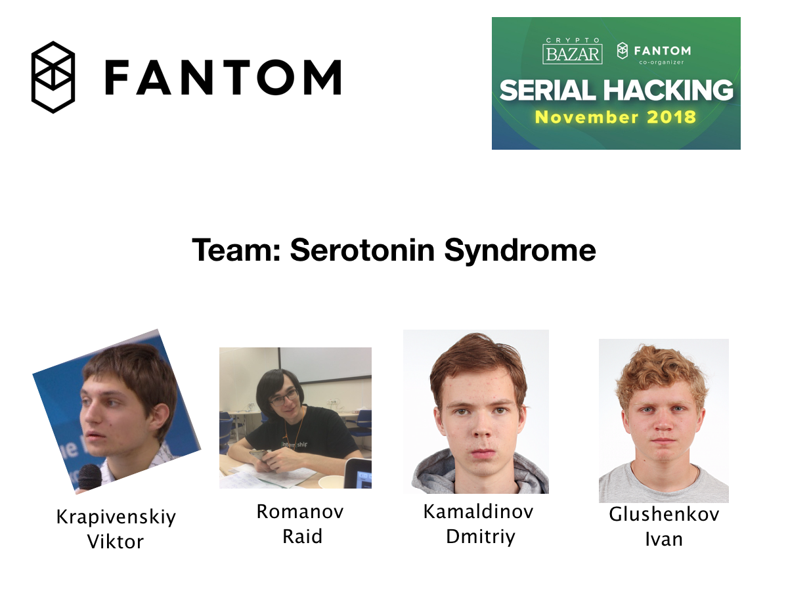
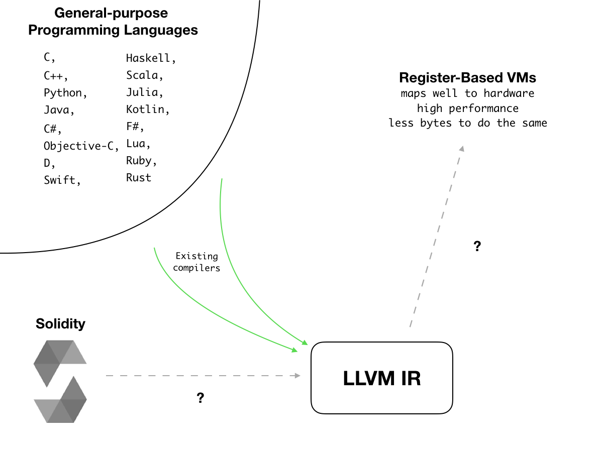
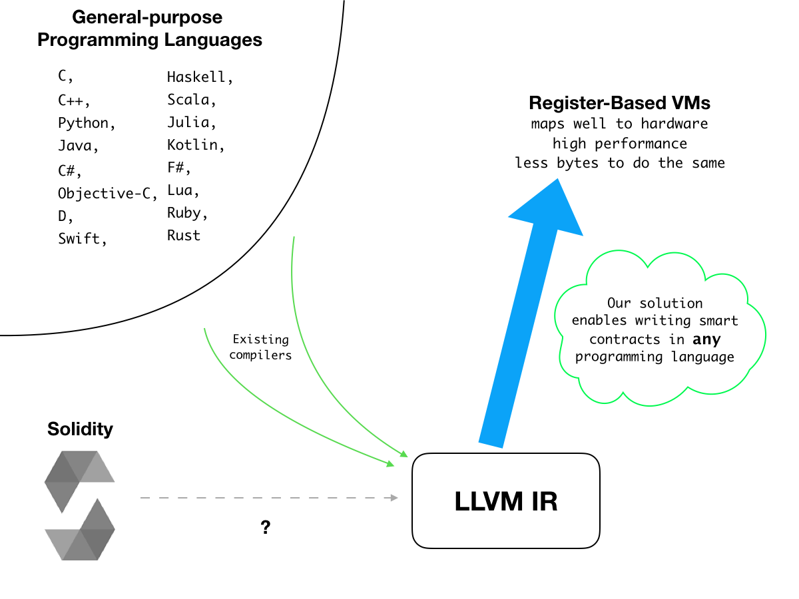
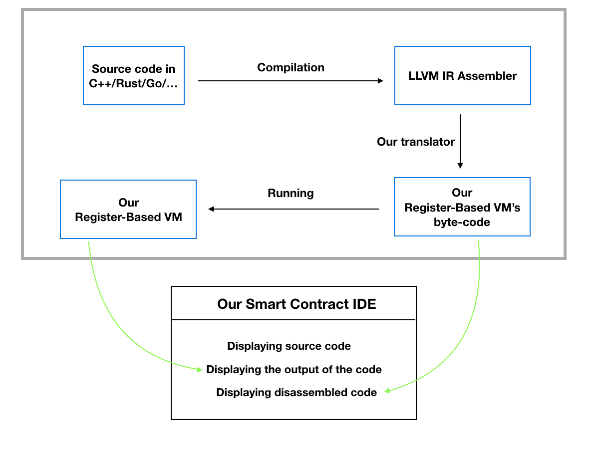
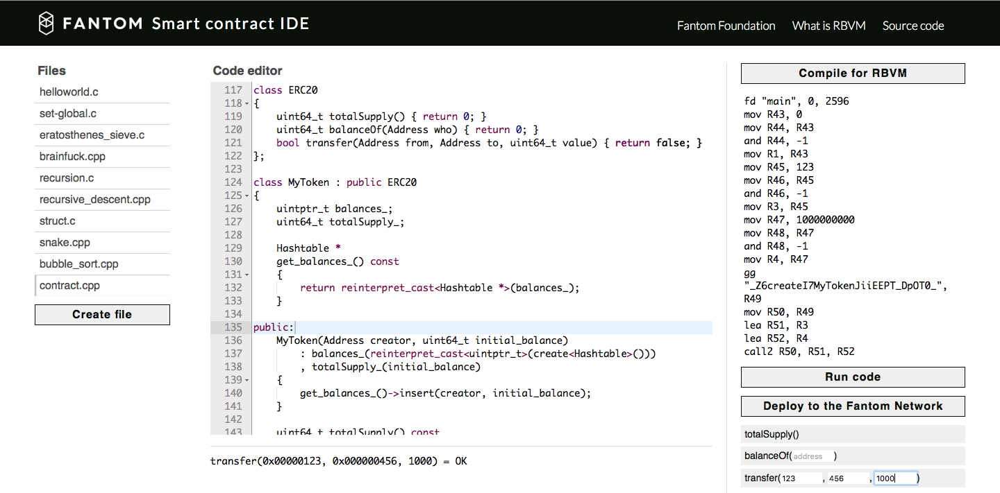
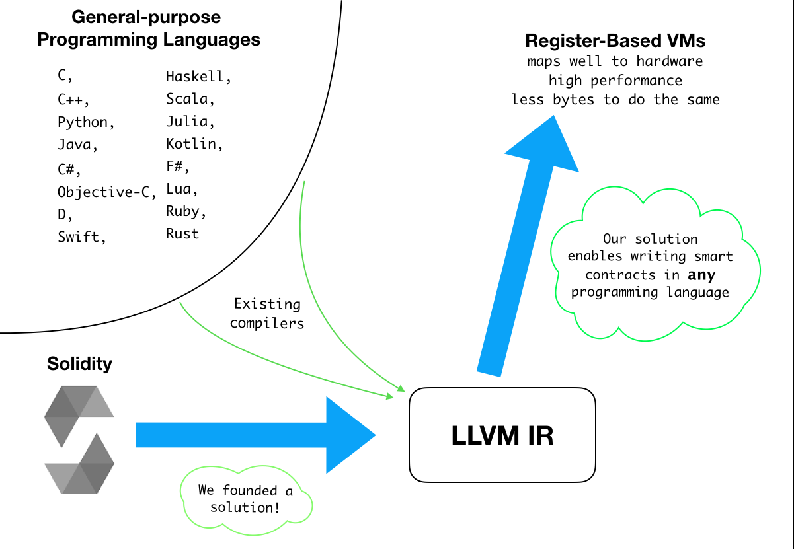
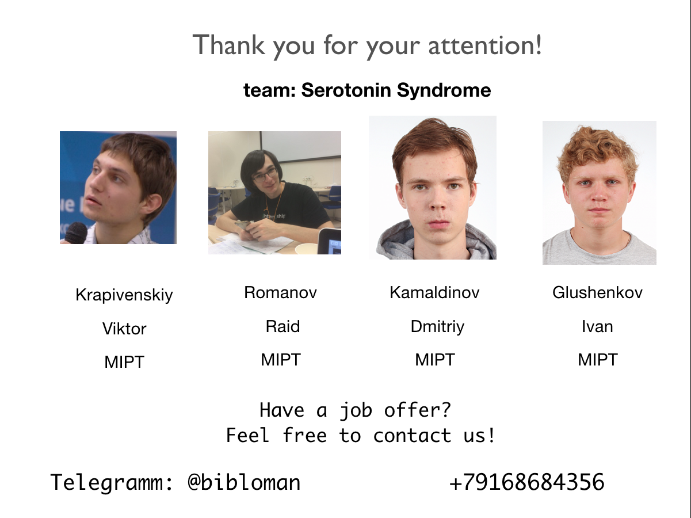

<p align="center">

</p>

# Structure
## [1) About](#about)
## [2) Fantom RBVM Task](#fantom-rbvm-task)
## [3) Solution](#solution)
#### [a) Translator from LLVM IR to RBVM](#solution)
#### [b) Fantom Smart Contract IDE](#fantom-smart-contract-ide)
#### [c) Virtual Machine Specification](#virtual-machine-specification)
#### [d) Installation and Test Runners](#installation-and-test-runners)
## [4) Surprise](#surprise)
## [5) Finally](#finally)
## [6) Team](#team)

# About
We are team **Serotonin Syndrome** and we have solved the *Register-Based Virtual Machine* Fantom task on the Serial Hacking:November.

About two weeks ago, the situation in the world was the following:

<p align="center">

</p>
Smart contracts development was not widely used because it requires special skills and learning Solidity.

# Fantom RBVM Task

The task was to develop Register-Based Virtual Machine and a translator from LLVM IR to its assembler.

# Solution

Our solution is the bridge between popular programming languages and high-performance Register-Based Virtual Machines.
It will be the core of ultimate-speed decentralised projects for the nearest future of digital economics.

<p align="center">

</p>

We created an infrastructure:

* <a href="https://gitlab.com/bibloman/serial_hacking_fantom_rbvm/blob/master/vm/RBVM.cpp"> Register-Based VM </a>.

* <a href="https://gitlab.com/bibloman/serial_hacking_fantom_rbvm/tree/master/llvm-backend"> Translator from LLVM IR </a> (it is the most complex part of solution, about 3000 lines of code!!!)

* <a href="https://gitlab.com/bibloman/serial_hacking_fantom_rbvm/blob/master/vm/disassembler.cpp">Disassembler</a>

to enable every developer in the world to write smart contracts in **any** language they want.
We think it is an excellent result for a single hackathon.

We’ve also created a <a href="http://209.97.131.179/#helloworld.c"> Smart Contract IDE.</a>

All the code is written in C++, we have also used `make` and Docker.

### Virtual Machine Specification

Scheme of our solution is below:
<p align="center">
    
</p>

Each stack frame has its own set of 256 registers.
```
<u64> = uint64_t.
<Reg> = uint8_t.
<string> = <length:u32> <char>...

<Program> = <Instr>...

<Instr> = fd <Name:string> <nargs:u64> <nskip:n64>  # function definition
       | mov <Reg> <Val>
       | ineg <Reg>
       | iadd <Reg> <Val>
       | add <Reg> <Val>
       | sub <Reg> <Val>
       | mul <Reg> <Val>
       | urem <Reg> <Val>
       | srem <Reg> <Val>
       | udiv <Reg> <Val>
       | sdiv <Reg> <Val>
       | and <Reg> <Val>
       | or <Reg> <Val>
       | xor <Reg> <Val>
       | shl <Reg> <Val>
       | lshr <Reg> <Val>
       | ashr <Reg> <Val>
       | fadd <Reg> <Val>
       | fsub <Reg> <Val>
       | fmul <Reg> <Val>
       | frem <Reg> <Val>
       | fdiv <Reg> <Val>
       | eq <Reg> <Val>           # == bitwise
       | ne <Reg> <Val>           # != bitwise
       | slt <Reg> <Val>          # <  as signed integers
       | sle <Reg> <Val>          # <= as signed integers
       | sgt <Reg> <Val>          # >  as signed integers
       | sge <Reg> <Val>          # >= as signed integers
       | ult <Reg> <Val>          # <  as unsigned integers
       | ule <Reg> <Val>          # <= as unsigned integers
       | ugt <Reg> <Val>          # >  as unsigned integers
       | uge <Reg> <Val>          # >= as unsigned integers
       | ld8 <Reg> <Val>          # <Reg> = *(uint8_t *)<Val>
       | ld16 <Reg> <Val>         # <Reg> = *(uint16_t *)<Val>
       | ld32 <Reg> <Val>         # <Reg> = *(uint32_t *)<Val>
       | ld64 <Reg> <Val>         # <Reg> = *(uint64_t *)<Val>
       | st8 <Val> <Reg>          # *(uint8_t *)<Val> = <Reg>
       | st16 <Val> <Reg>         # *(uint16_t *)<Val> = <Reg>
       | st32 <Val> <Reg>         # *(uint32_t *)<Val> = <Reg>
       | st64 <Val> <Reg>         # *(uint64_t *)<Val> = <Reg>
       | jmp <Off>                # unconditional relative jump
       | jz <Reg> <Off>           # relative jump if <Reg> == 0
       | lea <Reg1> <Reg2>        # <Reg1> = &<Reg2> (load effective address)
       | leave                    # leave function returning nothing
       | ret <Val>                # return <Val> from function
       | gg <Name:string> <Reg>   # get global
       | sg <Name:string> <Reg>   # set global
       | css <string> <Reg>       # create static string; write pointer to <Reg>
       | css_dyn <Reg1> <Reg2>    # create static string of length 8 and put <Reg2> into it
       | call0 <Reg>
       | call1 <Reg> <Reg1>
       | call2 <Reg> <Reg1> <Reg2>
       | call3 <Reg> <Reg1> <Reg2> <Reg3>
       | call4 <Reg> <Reg1> <Reg2> <Reg3> <Reg4>
       | call5 <Reg> <Reg1> <Reg2> <Reg3> <Reg4> <Reg5>
       | call6 <Reg> <Reg1> <Reg2> <Reg3> <Reg4> <Reg5> <Reg6>
       | call7 <Reg> <Reg1> <Reg2> <Reg3> <Reg4> <Reg5> <Reg6> <Reg7>
       | call8 <Reg> <Reg1> <Reg2> <Reg3> <Reg4> <Reg5> <Reg6> <Reg7> <Reg8>

call<N> functions put the return value into the function register (<Reg>).

Instructions that may take either a register or constant operand (<Val>) are encoded as follows:
   <instruction byte> <byte with value 0> <Reg>
or
   <instruction byte> <byte with value 1> <Constant:u64>
```

# Fantom Smart Contract IDE

UI of the IDE is the following:
<p align="center">
    
</p>

We provide examples in this web backend, which allow develop, compile, test, and deploy smart contracts to the Register-Based Virtual Machine: <a href="http://209.97.131.179/#contract.cpp"> See Live Demo.</a>


All the progress can be seen here as the examples of supported functionality, in the chronological order of creation:

* <a href="http://209.97.131.179/#helloworld.c"> Arrays and Strings;</a>
* <a href="http://209.97.131.179/#eratosthenes_sieve.c"> Loops and Conditions;</a>
* <a href="http://209.97.131.179/#brainfuck.cpp"> Simple functions;</a>
* <a href="http://209.97.131.179/#set-global.c"> Modifying global variables;</a>
* <a href="http://209.97.131.179/#recursion.c"> Recursion;</a>
* <a href="http://209.97.131.179/#struct.c"> Simple structures;</a>
* <a href="http://209.97.131.179/#snake.cpp"> And classes;</a>
* <a href="http://209.97.131.179/#bubble_sort.cpp"> Static Polymorphism;</a>
* <a href="http://209.97.131.179/#contract.cpp"> Analog of ERC20 Token.</a>

We’ve created the entire infrastructure for LLVM IR translation and now it is able to translate the subset of LLVM IR needed for C and C++.

But LLVM IR is quite a huge project and it was not possible to add support for all the instructions during only one hackathon, so, support of Rust, Python, Go and others is coming soon.


# Installation and Test Runners
### [1. Start Smart Contract IDE Using Docker](#start-smart-contract-ide-using-docker)
### [2. Test Backend Manually](#test-backend-manually)
### Start smart contract IDE Using Docker
Start docker.
Run this commands in Console/Terminal

```
git clone https://gitlab.com/bibloman/serial_hacking_fantom_rbvm && cd rbvm

docker build -t fantom-ide .

docker run -p 80:8080 -d fantom-ide
```
After that open `http://localhost:80` in your browser and you can see the our Smart Contract IDE

### Test backend manually
To launch and test our solution manually, follow this algorithm.

#### Step 1: Download source code.
(if you don't have git, install it <a href="https://git-scm.com/book/en/v2/Getting-Started-Installing-Git"> that </a> way)

Open Terminal/Console and run:
```
git clone https://gitlab.com/bibloman/serial_hacking_fantom_rbvm && cd rbvm
```

#### Step 2: Install LLVM 6 or 7.
In Debian or Ubuntu, this can be achieved by the following expedient:
```
apt-get install llvm-7 llvm-7-dev llvm-7-runtime
```
In Mac OS:
```
brew install llvm@7
```

#### Step 3: Build
```
make
```

### Step 4: Run tests.
```
make check
```
After that, you can find files LLVM IR files in `./*.ll` and the byte code for our VM in `./*.rbvm`.

#### Step 5: Run a particular test.
```
./compile-and-run examples/helloworld.c
```
# Surprise
During this hackathon we have gone through a huge amount of information and what's interesting, we have found that the first task "Solidity to LLVM IR" is already solved by the official ethereum developers.

You can find its source code <a href="https://github.com/ewasm/design/issues/149"> here </a>.
# Finally
<p align="center">

</p>

During this hackathon:
* we have created completely working RBVM-based infrastructure and Smart Contract IDE for development in **any** language compilable to LLVM IR
* we have been working more than two weeks without a break!
* we have solved **both** of the tasks and created a comprehensive ecosystem for developers

# Team
<p align="center">

</p>
